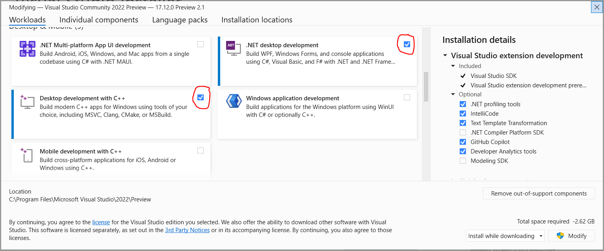

# Waola
Waola is a cross-platform open source **Wa**ke-**o**n-**LA**N (aka [WoL](https://en.wikipedia.org/wiki/Wake-on-LAN)) utility with embedded [ARP](https://en.wikipedia.org/wiki/Address_Resolution_Protocol)-based network scanner.

Project consists of several written in C11 libraries, platform-agnostic command line tool and also includes GUI frontends for each supported platform, written with most "native" for the given platform toolset.

Waola is designed to be built natively, run fast, consume as less system resources as possible and with an eye to be easily ported to any platform having C compiler and TCP/IP stack. The codebase has **no** external dependencies beyond your build system.

Currently supported are Linux, macOS and Windows.

## Building.
* Linux

    On Linux Waola is built with [GNU Autotools](https://en.wikipedia.org/wiki/GNU_Autotools). As a minimum you need [gcc](https://www.gnu.org/software/gcc/), [make](https://www.gnu.org/software/make/) and [pkg-config](https://www.freedesktop.org/wiki/Software/pkg-config/).
 
    WaolaG GUI frontend also requires [GTK-4](https://www.gtk.org/).

    Download [./dist/waola-X.Y.tar.bz2](./dist/waola-0.1.tar.bz2) and:
 
    ```
    tar -jxf waola-*.tar.bz2
    cd waola-X.Y && mkdir build && cd build
    ../configure
    make
    sudo make install
    ```

    You'll then find installed `/usr/local/bin/waolac` CLI tool and, if you have installed GTK-4, `/usr/local/bin/waolag` GUI frontend.

    Cool hackers who have installed [libtool](https://www.gnu.org/software/libtool/), [autoconf](https://www.gnu.org/software/autoconf/) and [automake](https://www.gnu.org/software/automake/) can also use `build.sh` and `build_debug.sh` scripts found in repository root.

* macOS

    You need [Xcode](https://developer.apple.com/xcode/) and its [Command Line Tools](https://developer.apple.com/download/all/).

    The libraries and CLI tool are proven to be build and run on macOS 12.7.6 Monterey with Xcode 14.2. The WaolaS, written in [Swift](https://developer.apple.com/swift/) GUI frontend, requires macOS version >= 14.6 Sonoma; proven to be build with Xcode 15.4 and 16.0.

    Run `./build_mac.sh` from Waola repository root; after script successfully finished you'll find CLI tool `waolac` and (if Swift requirements are met) `WaolaS.app` GUI frontend in the `Release` subdirectory.

    + [Berkeley Packet Filter](https://en.wikipedia.org/wiki/Berkeley_Packet_Filter).

        The WoL functionality of both CLI and GUI applications will just work out of the box. Not everything is so good with network scanning.
        
        Long story short: run `./macOsBpf/bpf_test.sh`. If you'll see '`Successfully opened /dev/bpfX for both reading and writing ~> you're all set`' - you're all set, start enjoying Waola. Otherwise run `sudo ./macOsBpf/install_daemon.sh` and ensure your user belongs to 'admin' group.
        
        The matter is that network scanning with ARP requests is performed on macOS through Berkeley Packet Filter devices `/dev/bpf*`, and the OS by default not only restricts access to these devices to the root only, but also restores these restriction on each reboot, so to use Waola scanning feature you need a) to set read-write permission for /dev/bpf* devices and b) restore this permission on each reboot. 

        There is a chance you have the permissions already adjusted (for example, [Wireshark](https://www.wireshark.org/) setup program can do this). To check the state of things, run `bpf_test.sh` from `macOsBpf` subdirectory. If you'll see '`Unable to open any BPF device for both reading and writing ~> you need to adjust /dev/bpf* permissions`', continue reading.

        There is an `install_daemon.sh` script in `macOsBpf` subdirectory. It ensures up to `$BPF_COUNT` `/dev/bpf*` devices, changes their permissions so that users belonging to 'admin' group can open them for both reading and writing and installs startup action which will do this on each reboot.

        In order to restore default permissions just run `uninstall_daemon.sh` script.  

* Windows

    You need [Visual Studio](https://visualstudio.microsoft.com/) with '.NET desktop development' and 'Desktop development with C++' workloads.

    

    Proven to be successfully built on Visual Studio Community 2022 (64-bit) Version 17.11.5 and Version 17.12.0 Preview 2.1, run on Windows Server 2016 and Windows 10.

    Run `build_win.cmd` from repository root; after script successfully finished you'll find in `x64\Release` subdirectory command line interface tool `waolac.exe` and GUI frontend `WaolaW.exe`.

    Also, in the `WaolaWPF/bin/x64/Release/net8.0-windows8.0` subdirectory you'll find WPF frontend `WaolaWPF.exe`. The latter needs .dlls from `x64\Release`.

## Usage.
* waolac.

    `waolac [mac_addr...]`

    , where `mac_addr...` is zero or more space-delimeted MAC addresses. Bytes of MAC address can be delimeted by `:`, `-` and can be not delimeted at all, i. e. `01:23:45:67:89:AB`, `01-23-45-67-89-AB` and `0123456789AB` are all valid (and equal).

    Being started without arguments `waolac` will scan network and print information about each discovered host in a form `<mac_addr>\t<ip_addr>\t<hostname>\n`.

    Started with MAC address(es) `waolac` sends appropriate WoL 'magic packet'(s) through all up and running network interfaces.

    Exit code: 0 if all appropriate 'magic packets' were successfully sent through all up and running network interfaces, othervise exit code.

* GUI frontends.

    Usage of GUI frontends is hopefully pretty intuitive. Two remarks about maybe not really obvious things:
    + double ckick on a host sends it WoL 'magic packet'.
    + Wakeup result `Success` does not ensure that target host has received 'magic packet' and woke up; it only means that the packet has been succesfully put on the wire.

* Logging.

    Waola logs to `stderr`. By default it's pretty silent application, as long as everything goes well it does not bore you with log messages. You can adjust log verbosity by setting `WAOLA_LOG_LEVEL` environment variable to one of the following, either textual or numeric, values:
    | Textual value | Numeric value |   Comment   |
    | ------------- | ------------- | ----------- |
    |    QUIET      |     -32       |             |
    |    PANIC      |     -24       |             |
    |    FATAL      |     -16       |             |
    |    ERROR      |     -8        |             |
    |    WARNING    |      0        | The default |
    |    INFO       |      8        |             |
    |    VERBOSE    |      16       |             |
    |    DEBUG      |      24       |             |
    |    TRACE      |      32       |             |
    
    Nota bene: `WaolaW` redirects `stderr` messages to `CSIDL_LOCAL_APPDATA\WaolaW\WaolaW.log`, i. e. `C:\Users\<your_user_name>\AppData\Local\WaolaW\WaolaW.log"` and has `INFO` log level by default instead of `WARNING`.
    
____

Author of this project is a citizen of Ukraine who developed and maintains this software literally under attacks of russian missiles.

Also I try to help our army to fight off the invasion as much as I can.

If this tool was useful to you and you'd like to help us to defend our freedom and independence - feel free to donate any convenient for you amount to PayPal account egggor@gmail.com.
